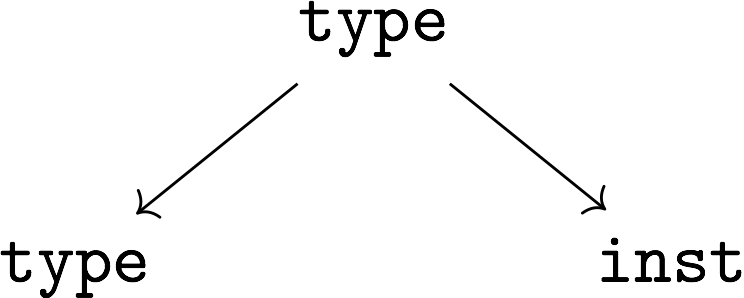
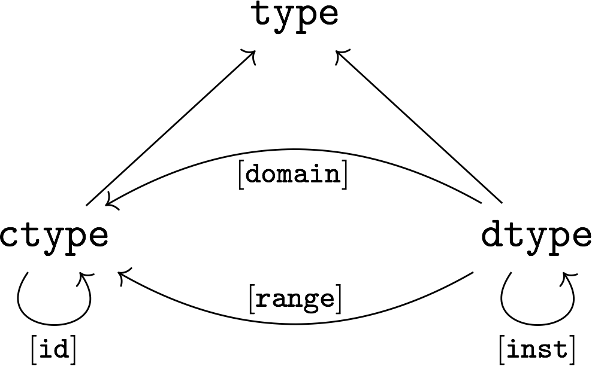
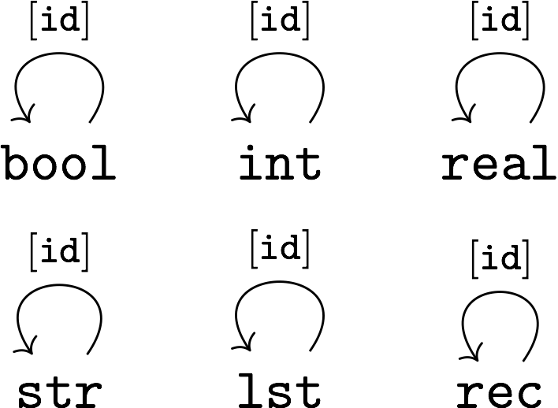
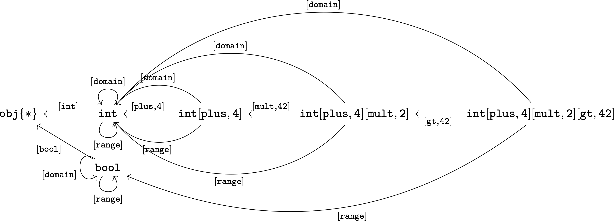

= mm-ADT: The Virtual Machine
Marko A. Rodriguez <marko@rredux.com>
:project-version: 0.1
:icons: font
:toc: left
:toclevels: 4
:doctype: book
:docinfo: shared-head
:stem: latexmath
:favicon: ./images/favicon.ico
:source-highlighter: coderay
:source-language: Delphi
:stylesdir: ./css
// :stylesheet: mmadt.css

image::images/mm-adt-logo.png[mm-ADT Logo,float="left",width=150]

http://mm-adt.org[mm-ADT] is a dual licensed https://www.gnu.org/licenses/agpl-3.0.txt[AGPL3]/commercial open source project that offers software engineers, computer scientists, mathematicians, and others in the software industry a royalty-based OSS model. The Turing Complete mm-ADT virtual machine (VM) integrates disparate data technologies via algebraic composition, yielding _synthetic data systems_  tailored to the computational requirements of a problem. As an economic model, each integration point offers the respective development team access to the revenue streams generated by any for-profit organization leveraging mm-ADT.

== Virtual Machine Components

[ditaa,"vm-components",align="center",float="right",shadows=false]
....
  /---------------------\
  |            mmADT VM |
  |                     |
  | bool,int,str,rec,.. |
  | strm,model,...      |
  | map,filter,branch,..|
  |                     |
  \-----*----*-----*----/
        |    |     |
    /---/    |     \-----\
    |        |           |
+---*----+ +-*-----+ +---*-----+
|{d}     | |  {s}  | | {io}    |
|        | |       | |         |
|language| |storage| |processor|
|        | |       | |         |
+--------+ +-------+ +---------+
....

The mm-ADT VM is the integration point for the following data processing technologies:

* *Programming Languages*: Language designers can create custom languages or develop parsers for existing languages that compile to mm-ADT VM bytecode (binary machine code) or unicode (text assembly code).
* *Storage Systems*: Storage engineers can embed their systems using _model-ADT_ functors expressed in mm-ADT's dependent type system that enable the lossless encoding of key/value store, document store, wide-column store, graph store, relational store, and other novel or hybrid structures such as hypergraph, docu-graph, and quantum data structures.
* *Processing Engines*: Processor developers enable their push- or pull-based execution engines to be programmed by any mm-ADT language for evaluation via mm-ADT's abstract execution model of atomic monadic traversers diffusing themselves over storage data structure via single-machine, multi-threaded, agent-based, distributed near-time, and/or cluster-oriented, batch-analytic processors.


The mm-ADT VM enables the intermingling of any language, any storage system, and any processor that can faithfully implement the core language semantics (types and values), storage semantics (streams of atomic and composite data structures), and/or processor semantics (monadic traversers up to the limits of the expressiveness of the components themselves.

=== The mm-ADT Console

The mm-ADT VM provides a https://en.wikipedia.org/wiki/Read%E2%80%93eval%E2%80%93print_loop:[REPL] console for users to evaluate mm-ADT programs written in any mm-ADT language. The reference language distributed with the VM is called `mmlang`. `mmlang` is a low-level, functional language that is in near 1-to-1 correspondence with the underlying VM architecture -- offering it's users https://en.wikipedia.org/wiki/Turing_completeness[Turing-Complete] expressively when writing programs and an interactive teaching tool for studying the internal structures and processes of the mm-ADT VM.

[source,text]
----
~/mm-adt bin/mmadt.sh
                                _____ _______
                           /\  |  __ |__   __|
 _ __ ___  _ __ ___ _____ /  \ | |  | | | |
| '_ ` _ \| '_ ` _ |_____/ /\ \| |  | | | |
| | | | | | | | | | |   / ____ \ |__| | | |
|_| |_| |_|_| |_| |_|  /_/    \_\____/  |_|
                                 mm-adt.org
mmlang>
----

A simple console session is presented below, where the parser expects programs written in the language specified left
of the `>` prompt. All the examples contained herein are presented using `mmlang`.

[source]
----
mmlang> 1
==>1
mmlang> +2
==>[plus,2]
mmlang> 1+2
==>3
mmlang> 1[plus,2]
==>3
----

== Language Structures

image::images/obj-type-value-q.png[float="left",width=300]

The mm-ADT VM operates on quantified objects known as `objs`. Every object is either a *type* or a *value*.

\[
\begin{split}
\tt{obj} &=\;& \tt{object} * \tt{q} \\
\tt{object} &=\;& \tt{type} + \tt{value}
\end{split}
\]

A type denotes a _stream_ (i.e. https://en.wikipedia.org/wiki/Multiset[multi-set] or bag) of `obj` values. Values denote atomic or composite datum existing outside the mm-ADT VM within it's execution environment. For instance, if an mm-ADT VM is implemented on the https://en.wikipedia.org/wiki/Java_virtual_machine[JVM], then the `str` value `'mmadt'` refers to the `java.lang.String` instance `"mmadt"`. Both `obj` types and values have associated *quantifiers* (`q`). The meaning of quantification is dependent on the quantifier type used with an mm-ADT program (e.g. integers, reals, unitary matrices, etc.). However, in general, the intuition is that the quantifier denotes the _amount_ of values being referred to.

The axioms of https://en.wikipedia.org/wiki/Ring_theory[algebraic ring theory] specify that rules of type composition and thus, how programs are written, streams are constructed, functions are defined, and of particular import to mm-ADT, how functorial mappings between different https://en.wikipedia.org/wiki/Abstract_data_type[abstract data types] are specified.

=== Types

image::images/obj-monoid.png[float="right",width=70]

mm-ADT types serve numerous roles which are typically realized by many different sorts of objects in traditional programmable systems. The reason for this singular use is quite literally because the mm-ADT type system is generated from the https://en.wikipedia.org/wiki/Monoid[monoid] `obj{*}`, where it's elements (i.e. types) ultimately refer to streams of values. mm-ADT program evaluation dereferences the type denoting the program in order to yield referent values -- program results.



An mm-ADT *type* is the product of a type and an instruction (`inst`), where the type component serves as the _domain_, the instruction component the _function_, and the type product as a whole, relative to it's components, the _range_.

\[
\begin{split}
\tt{type} &=\;& \tt{type} &*\;& \tt{inst}   \\
\text{“range} &=\;& \text{domain} &*\;& \text{function"}
\end{split}
\]



This recursive definition is grounded at the 6 *canonical types* (called _ctypes_): `bool`, `int`, `real`, `str`, `lst`, and `rec`. Every canonical type is it's own domain and range, via the respective type generating instruction of the terminal object `obj{*}`.

.Canonical type and derived type morphisms
[frame=none,halign=center,cols="^m,^m"]
|===
|  | image:images/dtypes.png[]
|===


From the canonical types, the set of all *derived type* (called _dtypes_) can be inductively generated via the application of instructions from the mm-ADT VM instruction set architecture. Every mm-ADT `inst` processes both type and value `objs`. When processing a type, the `inst` yields a new `dtype` structurally related to the previous type by the respective `inst`. For instance:

\[
\tt{int[plus,4][mult,2][gt,42]}\\
\]



[source]
----
mmlang> int
==>int
mmlang> int[plus,4]
==>int[plus,4]
mmlang> int[plus,4][mult,42]
==>int[plus,4][mult,42]
mmlang> int[plus,4][mult,42][gt,42]
==>bool<=int[plus,4][mult,42][gt,42]
----

NOTE: Instructions and quantifiers are the carrier sets of two independent https://en.wikipedia.org/wiki/Ring_(mathematics)[rings] with unity whose https://en.wikipedia.org/wiki/Direct_product[direct product] forms the
mm-ADT *type ring* and is the subject of study in https://zenodo.org/record/2565243[stream ring theory] (SRT). The type data structure above is a subgraph of the https://en.wikipedia.org/wiki/Cayley_graph[Cayley graph] formed from the multiplicative https://en.wikipedia.org/wiki/Group_(mathematics)[group] component of that ring. A lengthy discussion of the mm-ADT type ring is forthcoming.


The last line above highlights the two components of a type: _signature_ and _definition_.

[source]
----
range{q}<=domain{q}([inst]{q})*
|_________________||__________|
     signature      definition
----

==== Type Signatures

Every mm-ADT type can be generally understood as a function that maps an `obj` of one type to an `obj` of another (potentially
equivalent) type. A *type signature* specifies the source and target of this mapping.

[source]
----
range{q}<=domain{q}
----

Type's that are fully specified by their type signature are always canonical types. The examples below demonstrates various `ctype` expressions in order to highlighting various `mmlang` syntax sugars.

[source]
----
mmlang> int{1}                <1>
==>int
mmlang> int<=int              <2>
==>int
mmlang> int<=bool             <3>
error: bool is not a int
mmlang> int{5}                <4>
==>int{5}
mmlang> int{0,5}              <5>
==>int{0,5}
mmlang> int{0,5}<=int{0,5}    <6>
==>int{0,5}
----
<1> In most programming languages, a value can be typed `int` as in `val x:int`. Such https://en.wikipedia.org/wiki/Declaration_(computer_programming)[declarations] state that the value referred to by `x` is a _single_ element within the set of integers. The concept of a "single element" is captured in mm-ADT via quantification. When the quantifier is the https://en.wikipedia.org/wiki/Unit_(ring_theory)[unit] of the underlying quantifier ring, then the quantifier is not displayed in `mmlang`.
<2> An mm-ADT `int` is a https://en.wikipedia.org/wiki/NOP_(code)[no-op] identity instruction on the set of integers. Given an integer, `int` returns the integer. In `mmlang`, when the domain and range are the same, the `<=` and repeated type are not displayed.
<3> Without any instructions, there is no way for a type to legally map a `bool` to an `int`.
<4> An mm-ADT type always refers to an unordered https://en.wikipedia.org/wiki/Multiset[multi-set] (or bag) of elements known as a _stream_. `int{5}` is a type referring to 5 integers (with repeats possible). As a point of comparison, `int` denotes a stream containing a single integer. This is why `int` is syntactic sugar for `int{1}` in `mmlang`.
<5> The quantifier ring can be any ring with unity. In the previous examples, the chosen ring's https://en.wikipedia.org/wiki/Algebraic_structure[carrier set] was the set of integers. In this example, the carrier set is two integers and is used to capture uncertainty as to the number of elements being referred to. `int{0,5}` is a type referring to either 0, 1, 2, 3, 4, or 5 integers.
<6> This further emphasizes the fact that every mm-ADT type (even canonical types) are functions with a quantified domain and a quantified range.

==== Type Definition

mm-ADT type signatures specify the base type and quantity of the type's domain and range. Further specification of the nature of the elements of the type is accomplished via a *type definition*. The following mm-ADT type is a https://en.wikipedia.org/wiki/Refinement_type[refinement type] -- it provides further
constraint/refinement to `int`. In particular, it is the mm-ADT definition of a natural number in \$\mathbb{N}\$.

\[
\tt{int[is,[gte,0]]} := \mathbb{N}
\]

[source]
----
int[is,[gte,0]]
   ||_||_____||
   |op   arg  |
   |__________|
   instruction
----

The structure `[is,[gte,0]]` is an *instruction* with a single argument. mm-ADT instruction opcodes denote specific operations explicitly implemented by the mm-ADT virtual machine. The set of all mm-ADT instructions forms the machine's https://en.wikipedia.org/wiki/Instruction_set_architecture[instruction set architecture].

A type is transformed into another type via an instruction application. Every instruction is able to operate on both types and values. In this way, instruction application on types yields program _compilation_ and instruction application on values yields _evaluation_. The compilation of a type produces a type, where quantification and domain/range specifications are inferred when unspecified by the user.

[source]
----
mmlang> int[is,[gte,0]]                      <1>
==>int{?}<=int[is,bool<=int[gte,0]]          <2>
mmlang> 6 int{?}<=int[is,bool<=int[gte,0]]
==>6                                         <3>
mmlang> -6 int{?}<=int[is,bool<=int[gte,0]]  <4>
mmlang>
----
<1> A base type composed with an instruction/quantifier pair, where the quantifier is not displayed as it's the unit
of the quantifier ring -- `{1}`.
<2> A compiled type that maps a single integer to zero or one integers. If the internal `bool<=int[gte,0]` type yields
`true`, then an `int{1}`, else `int{0}`.
<3> The type maps the positive integer `6{1}` to `6{1}` (_some_).
<4> The type maps the negative integer `-6{1}` to `-6{0}` (_none_).

NOTE: Any `obj` with the the quantifier ring's additive identity (`zero`) is not displayed by `mmlang` and can be safely garbage collected by the mm-ADT VM processor at anytime throughout a non-reducing computation without altering the semantics of the computation.

==== The Type Ring

The previous sections demonstrated aspects of mm-ADT's type theory. This section will present the full axiomatic semantics which is founded on ring theory and in particular, https://zenodo.org/record/2565243[stream ring theory].

NOTE: In stream ring theory, instructions are called _functions_ and quantifiers are called _coefficients_. A function-coefficient pair is called a _stream_. The equivalence highlights the fact that mm-ADT types refer to streams of objects (i.e. https://en.wikipedia.org/wiki/Multiset[multi-sets] or bags).


If \$<A,+,*>\$ is a ring with \$A\$ the carrier set, \$0 \in A\$ the additive identity, \$1 \in A\$ the multiplicative identity, and \$a,b,c \in A\$, then the ring must obey the itemized axioms and benefit from the deductions that yield the common implications and equalities.

.The Ring Axioms and Useful Deductions
|===
|Ring Axioms                        |Popular Entailments

|`(a + b) + c = a + (b + c)`        |`a + b = a + c => b = c`
|`0 + a = a + 0 = a`                |`a + b = 0 => a = -b & b = -a`
|`a - a = a + (-a) = 0`             |`-(a+b) = (-a) + (-b)`
|`a + b = b + a`                    |`-(-a) = a`
|`(a * b) * c = a * (b * c)`        |`a*0 = 0 = 0*a`
|`1 * a = a * 1 = a`                |`a * (-b) = -a * b = -(a * b)`
|`(a + b) * c = (a * c) + (b * c)`  |`(-a) * (-b) = a * b`
|`a * (b + c) = (a * b) + (a * c)`  |
|===

The type system of mm-ADT is characterized by a particular formulation of the https://en.wikipedia.org/wiki/Product_ring[direct product of rings]
over the _quantifier_ and _instruction_ rings. The direct product of these two rings is a ring itself. Thus, mm-ADT's types are founded on ring theory.

===== The Instruction Ring

In mm-ADT, the carrier set of the *instruction ring* is the set of all instructions, where

* `inst` is the carrier set,
* `*` is serial composition,
* `+` is parallel composition,
* `0` is `[none]` and
* `1` is `[all]`.

In the examples below `[a]`, `[b]`, and `[c]` are variable instructions in `inst`.

.The Ring Axioms Expressed in mmlang
[cols="2,4"]
|===
|Ring Axioms                        |Related mmlang Types

|`(a + b) + c = a + (b + c)`        |`[branch,[branch,[a],[b]],[c]] == [branch,[a],[branch,[b],[c]]]`
|`0 + a = a + 0 = a`                |`[branch,[none],[all]] == [branch,[all],[none]] == [all]`
|`a - a = a + (-a) = 0`             |`[branch,[id],[id]{-1}] == [none]`
|`a + b = b + a`                    |`[branch,[a],[b]] == [branch,[b],[a]]`
|`(a * b) * c = a * (b * c)`        |`[map,[a][b]][c] == [a][map,[b][c]]`
|`1 * a = a * 1 = a`                |`[all][a] == [a][all] == [a]`
|`(a + b) * c = (a * c) + (b * c)`  |`[branch,[a],[b]][c] == [branch,[a][c],[b][c]]`
|`a * (b + c) = (a * b) + (a * c)`  |`[a][branch,[b],[c]] == [branch,[a][b],[a][c]]`
|===

IMPORTANT: A known "bug" in stream ring theory is that not all instructions in `inst` have an additive inverse. Thus, it is not the case that every instruction set can serve as the carrier of a ring. Fortunately, in the larger composite type ring (discussed later), which forms the primary algebraic structure in mm-ADT's type system, the quantifier ring's multiplicative inverse can be used to remedy the situation--see the 3rd entry in the table above.

\[
\texttt{x[branch,[a],[b]]} = <\texttt{x[a]},\texttt{x[b]}>
\]

As an example, the instructions `[plus,10]` and `[gt,5]` can be combined via serial and/or parallel composition. In general, all serial and parallel compositions are https://en.wikipedia.org/wiki/Associative_property[associative] except for those that use instructions from a particular `inst` subring: _the reduce near-ring_ (discussed later).

[source]
----
mmlang> [plus,10] ** [gt,5]
==>[plus,10][gt,5]
mmlang> [plus,10] ++ [gt,5]
==>[branch,[plus,10],[gt,5]]
----

Finally, the https://en.wikipedia.org/wiki/Distributive_property[distributivity] of multiplications over addition is made apparent with expressions below which have a diagrammatic representation, where the edges/arrows are streams of `objs` that are being operated on by the `insts` vertex/objects they meet along the way. Whenever the diagram branches, the `obj` at the branch is cloned, taking *both* branches.

[source]
----
[plus,10][branch,[gt,5],[lt,2]]    ==  [branch,[plus,10][gt,5],[plus,10][lt,2]]
----

// https://tikzcd.yichuanshen.de/#N4Igdg9gJgpgziAXAbVABwnAlgFyxMJZARgBpiBdUkANwEMAbAVxiRAB12cdhkAjAE50wAYwAWpAL4hJpdJlz5CKAEykADFVqMWbTt14BzHKQCsFabPnY8BImpVb6zVog5ceyBiceW5IDBslInVyJx1XdwNkNGY4ck0-a0U7FABmMOpnXTd9HgsZf0CU5WQAFkztFz12GABHJiwaQuTbUtNK7Mi83kFhcSkWgIU2ogA2DXDq3I9eWKZ44kSh4tGUCccsiJro+cXlq2Gg1OQAdkmt6ajPYzMCw9XglHPNqpzr3m9SXxWRp+QABydbYzAz3LQwKCGeBEUAAMwEEAAtkhQiAcBAkMRDgjkajqBikCocYiUYgMujMYh1CS8YgyJSkGVaWS1IzEMz-LiyRN2acWUheYTEACBYhzuyAJxioHspZipYEqnEbFc0lISVKrHYixAA
image::images/inst-left-distrib.png[width=750,align=center]

[source]
----
[branch,[plus,10],[mult,5]][gt,7]  ==  [branch,[plus,10][gt,7],[mult,5][gt,7]]
----
// https://tikzcd.yichuanshen.de/#N4Igdg9gJgpgziAXAbVABwnAlgFyxMJZABgBoBGAXVJADcBDAGwFcYkQAdDnHYZAIwBO9MAGMAFqQC+IKaXSZc+QinKli1Ok1bsuPPmhZwKGmXIXY8BImoBMmhizaJO3XsgC2zRjlIBWSjN5EAxLZSJbCgdtZ1d9QNlg0KVrFAAWKJpHHRcuGABHZixaRIsUlWQ-TK0nXTc+IREJaVKQxSsKgDZ1aNrc+uRDZmNyU1bkjqJu+yyYuv1Pb18AoLLJlAB2Htm+uPcAc18NhPM2sNTkLZmanL2+Q9Jj1bPyogAOauzYvV4TpPbwigAMyfOb9BYPJ6yTQwKD7eBEUAAM0EEA8SDIIBwECQ5FOKLRGJo2KQtnxqPRiDUWJxiCB5MJiEiNKQ9OCBMpVRZiE6DM5xNpGz5SG63LewsQW25AE4JdKBbjiBKPtzRhKQaq8YEgA
image::images/inst-right-distrib.png[width=750,align=center]

===== The Quantifier Ring

.Quantifier Symbols in mmlang
[width=35%,cols="1,1,2,float=right]
|===
|usage   |sugar  | unsugared

|https://en.wikipedia.org/wiki/Option_type[none]/nothing   |`{0}`  | `{0,0}`
|https://en.wikipedia.org/wiki/Option_type[some]/just      |       | `{1,1}`
|exact          |`{x}`  | `{x,x}`
|least footnote:order[Applicable to quantifier rings with an total order over the carrier.]         |`{x,}` | `{x,max}`
|most footnote:order[]          |`{,x}` | `{min,x}`
|https://en.wikipedia.org/wiki/Option_type[option]/maybe   |`{?}`  | `{0,1}`
|given footnote:order[]         |`{+}`  | `{1,max}`
|any footnote:order[]           |`{*}`  | `{1,max}`
|===


In the https://en.wikipedia.org/wiki/Type_theory#Difference_from_set_theory[set-theoretic interpretation of types], a type denotes a set in *Set*. A set does not contain repeated elements. A _stream_ generalizes a set. A stream is an unordered collection of `objs` of varying cardinality (a multi-set, or bag). For example, in mm-ADT, `int` is shorthand for `int{1}`--a single integer. This is analogous to other languages, where when `int` is used to define a value, it is referring to a single integer from the set of all integers--e.g., `val answer:int = 42`. Where mm-ADT differs from other languages is that `bool{42}` is a type denoting `42` boolean values.

All `mmlang` expressions within `{ }` operate on the mm-ADT VM's *_quantifier ring_* (w/ unity). Any object that supports `+`/`*`/`0`/`1` and the axioms governing their composition can be used as an mm-ADT quantifier. Along with Turing Complete types specifications, type definitions can be specified to as accurate or fuzzy a degree as computationally and conceptually possible.

Typically, the quantifier of choice for most applications is the `int` ring (or `int` range ring -- `{2,13}`). Common programming concepts that are usually captured by typeclasses or functors (via https://en.wikipedia.org/wiki/Lift_(mathematics)[lifting]) are expressed in mm-ADT via quantification.

[source]
----
int                                  // a single int   (some)
int{?}<=int[is,[gt,0]]               // 0 or 1 int     (option)
int{0}<=int[is,false]                // 0 ints         (none)
int{4}<=int{2}[branch,[id],[id]]     // 4 ints         (exact)
int{*}<=[=db][get,'costs']           // 0 or more ints (any)
----

==== Type Categories

--
.Definition: Type Category
An mm-ADT *Type* category is composed of `obj` _objects_ denoted `type` and a set of instruction _morphisms_ denoted `inst`. If two types objects are distinct by a single tail instruction, then there exists an `inst` morphism \$\tt{[a]}: X->Y\$ where the \$\mathcal{Dom}(\tt{[a]})\ * \tt{[a]} = \mathcal{Cod}(\tt{[a]})\$. The identity morphism of every `type` object is the `[id]` instruction. Every mm-ADT type category https://en.wikipedia.org/wiki/Commutative_diagram[commutes].
--

The https://en.wikipedia.org/wiki/Commutative_diagram[commutative diagram] of a simple type category is presented below where:

. _Objects_: `int`, `int[plus,2]`, `int[plus,2][plus,8]`, and `int[plus,2][plus,10]`
. _Morphisms_: `[plus,2]`, `[plus,8]`, `[plus,10]`, and respective identity instructions.


image::images/type-equiv.png[width=600,align="center"]

Every path through the diagram specifies a particular type construction

Thus, every mm-ADT program is an mm-ADT type. There exists an mm-ADT canonical type graph derived by from the previous type graph via a https://en.wikipedia.org/wiki/Forgetful_functor[forgetful functor], where the vertices denote the 6 base types and the edges denote https://en.wikipedia.org/wiki/Endomorphism[endomorphisms] of the base type monoid or https://en.wikipedia.org/wiki/Homomorphism[homomorphisms] between two type monoids.


////
==== Common Type Classifications in mm-ADT's Type Theory

mm-ADT types differ from convention in that they serve to denote:

* *canonical types*: sets of elements denoted as `int` or `str`, etc.
* *refined types*: constraints on the canonical set types such as `nat<=int[is,[gt,0]]`
* *quantified types*: specifying the cardinality of a set via quantification `int{0,5}` (a type of 0 to 5 `int` values).
* *dependent types*:
* *translating types*: specify a mapping from a domain set of elements to a range set of elements as in `int[plus,2]`.
* *recursive types*:
////

=== Values

There are only two kinds of structures in mm-ADT: _values_ and _types_.
Values are the elements of standard data type sets such as:

[source,Delphi]
----
mmlang> 45[plus,5][plus,[mult,2]]
==>150
mmlang> 'a','b','c'[fold,'seed','',[plus,str<seed>]]
==>'abc'
mmlang> 1,2,3[plus,2]<x>[plus,3]<y>[as,rec['a':int<x>,'b':int<y>]]
==>['a':3,'b':6]
==>['a':4,'b':7]
==>['a':5,'b':8]
mmlang> ['a':['b':['c':['d':0]]]]
==>['a':['b':['c':['d':0]]]]
mmlang> ['a':['b':['c':['d':0]]]].a.b.c.d
==>0
mmlang> .a
==>[get,'a']
----

////
=== Model Categories and their Functors

An mm-ADT _model_ specifies relationships between a set of types within a https://en.wikipedia.org/wiki/Domain_of_discourse[_domain of discourse_].
These relationships are https://en.wikipedia.org/wiki/Path_(topology)[path equations] that specify semantic equivalences between types.
There are two general classes of models:

. *Category*: A category model has `ctype` and `type` mappings to other `ctypes` and `types` within the category.
. *Functor*: A functor model maps `ctypes` and `types` from one category model to a `ctypes` and `types` in another category model.

Every mm-ADT model excluding instructions from the reduce near-ring, forms a https://en.wikipedia.org/wiki/Category_(mathematics)[category], where
the category's _objects_ are the canonical types (`ctypes`) and the _arrows_ are types that span the canonicals.
mm-ADT models are defined via types that are constructed via the instruction ring where both `+` and `*` are associative
and the `[id]` instruction serves as the identity as in `int<=int[id]`.

A _model_ is a `rec` that specifies how a "left-hand side" (LHS) type maps to a "right-hand side" (RHS) type.
Both object and arrow morphisms are captured in this structure.
The model below is a _functor model_ in that is specifies how to move from the category of `int` to the category of `nat`.

[source]
----
rec[
  int<=int[is,[gte,0]] -> nat,
  int[plus,[id]]       -> nat[mult,2]]
----

The above model is diagrammed below where object morphisms are solid lines and the arrow morphism is the dotted line.

[ditaa,"int-nat-functor",align="center"]
....
         int---[plus,[id]]--->int

           |         |          |
           |         |          |
int[is[gte,0]]       :         int[is[gte,0]]
           |         |          |
           v         v          v

         nat-----[mult,2]---->nat
....

[source]
----
mmlang> :model clear
mmlang> :model rec[int<=int[is>=0] -> nat]
mmlang> :model rec[int + [id] -> nat * 2]
mmlang> :model
int ->
	int[is,bool<=int[gte,0]] -> nat
	int[plus,int[id]] -> nat<=int[is,bool<=int[gte,0]][mult,2]
mmlang> 32
==>nat:32
mmlang> 32[plus,[id]]
==>nat:64
mmlang> int[plus,[id]][explain]
==>str<=[start,'
nat<=int[is,bool<=int[gte,0]][mult,2]
instruction             domain      range    state
---------------------------------------------------
[is,bool<=int[gte,0]]    int    =>   int{?}
 [gt,0]                  int   =>    bool
[mult,2]                nat    =>   nat
']
mmlang>
----
////
////
A complex type definition is provided below that captures a large number of the mm-ADT type constructs.

[source]
----
int<=int{2}<x>[plus,10]<y>[is.<10 -> <x>
                          |is.<20 -> <y>
                          |int    -> <x>+<y>][count]
----

.mmlang Language Structures
[cols="75,1,200"]
|===
|Classification          |`mmlang` |Description

|`obj` instruction       |`[ ]`    |The bulk of instructions operate on `objs`.
|traverser instruction   |`< >`    |Traversers are independent computational contexts that can be programmed.
|quantifiers             |`{ }`    |Every `obj` has a quantity as specified by the associated algebraic ring w/ unity.
|branching instructions  |`[->]`   |A `rec` type is used for guarded branching.
|domain/range specifies  |`<=`     |Every type has a domain and a range. Classic types have are endomorphisms.
|===
////

=== mmlang Syntax and Semantics

The https://en.wikipedia.org/wiki/Context-free_grammar[context-free grammar] for `mmlang` is presented below.

[source]
----
obj   := (type | value){q}
type  := ctype | dtype
ctype := bool | int | real | str | rec | inst
q     := int,int
dtype := ctype<=ctype([inst]+)
rec   := [:] | [obj:obj(,obj:obj)*]
inst  := [op(,obj*)]
op    := a, as, branch, choose, plus, mult, is, ...
----

The following https://en.wikipedia.org/wiki/Axiomatic_semantics[language axioms] have variables `x`, `y`, and `z` in `ctype` and `[a]` and `[b]` in `inst`.

[source]
----
id(x)                      := x<=x[id]
domain(y<=x[a])            := x
range(y<=x[a])             := y
domain(x)                  := x
range(x)                   := x
scompose(y<=x[a],z<=y[b])  := z<=x[a][b]
pcompose(y<=x[a],y<=x[b])  := y<=x[branch,y<=x[a],y<=x[b]]
pcompose(y<=x[a],z<=x[b])  := obj<=x[branch,y<=x[a],z<=x[b]]
----

The quantifiers of an `mmlang` program are elements of a ring with unity (the quantifier ring). In the following equations, `*` and `+` refer to the respective monoid and group operations of the program's associated quantifier ring.

[source]
----
scompose(y{q1}<=x[a],z{q2}<=y[b]) := z{q1*q2}<=x[a][b]
pcompose(y{q1}<=x[a],y{q2}<=x[a]) := y{q1+q2}<=x[a]
pcompose(y{q1}<=x[a],y{q2}<=x[b]) := y{q1+q2}<=x[branch,y{q1}<=x[a],y{q2}<=x[b]]
pcompose(y{q1}<=x[a],y{q2}<=x[b]) := obj{q1+q2}<=x[branch,y{q1}<=x[a],z{q2}<=x[b]]
----

The following inference rules reuse the same variables as the equations above.

[source]
----
xxx   yyy      xxx   yyy
_________      _________
    zz            zz
----

== Storage Structures

== Processor Structures

== Reference Guide

=== Instructions

:leveloffset: +1

==== Branch Instructions

===== [choose]

```
y<=x[choose,y<=x:type,(y<=x:type)*]
```

==== Filter Instructions

===== [is]

```
obj<=obj[is,bool]
```

`[is]` is the canonical filter instruction.

```
x:obj[is,y:bool] = [ y[eq,true]  -> x
                   | y[eq,false] -> x[q,0] ]
```

```
mmlang> 6,42[is,true]
==>6
==>42
mmlang> 6,42[is,false]
mmlang> 6,42[is,[a,int]]
==>6
==>42
mmlang> 6,42 is[a,int]
==>6
==>42
mmlang> 6,42[is,[gt,10]]
==>42
mmlang> 6,42[is,[lt,10]]
==>6
mmlang> 6,42[is>10]
==>42
mmlang> 6,42 is>10
==>42
mmlang> int{2}[is>10]
==>int{0,2}<=int{2}[is,bool{2}<=int{2}[gt,10]]
```

==== Map Instructions

===== [a]

```
bool<=obj[a,type]
```

===== [and]

```
bool<=bool[and,bool]
```

===== [eq]

```
bool<=obj[as,obj]
```

===== [get]

```
y <= rec[x:y][get,x]
```

===== [gte]

```
bool<=x[gte,x:ord]
```

===== [gt]

```
bool<=x[gt,x:ord]
```

===== [id]

```
obj<=obj[id]
```

===== [lte]

```
bool<=x[lte,x:ord]
```

===== [lt]

```
bool<=x[lt,x:ord]
```

===== [map]

```
x<=obj[map,x:type]
```

===== [mult]

```
x<=x[mult,x:mmonoid]
```

===== [neg]

```
x<=x[neg,x:pgroup]
```

===== [one]

```
x<=x:mmonoid[one]
```

===== [or]

```
bool<=bool[or,bool]
```

===== [plus]

```
x<=x[plus,x:pmonoid]
```

===== [q]

```
ring<=obj{ring}[q]
```

===== [zero]

```
x<=x:pmonoid[one]
```

==== Model Instructions

===== [as]

```
x<=obj[as,x:type]
```

==== Reduce Instructions

===== [count]

```
ring:x<=obj{ring:x}[count]
```

===== [fold]

==== SideEffect Instructions

===== [error]

```
obj<=obj[error,str]
```

==== Traverser Instructions

===== [explain]

```
str<=type[explain]
```

===== [from]

```
y<=obj<x:y>[from,x]
```

===== [to]

```
y<x:y><=y[to,x]
```
